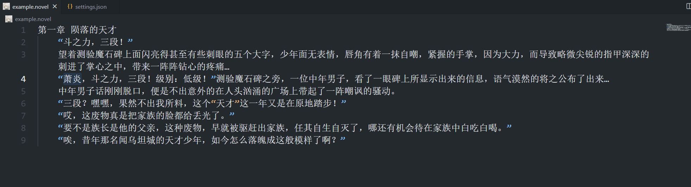
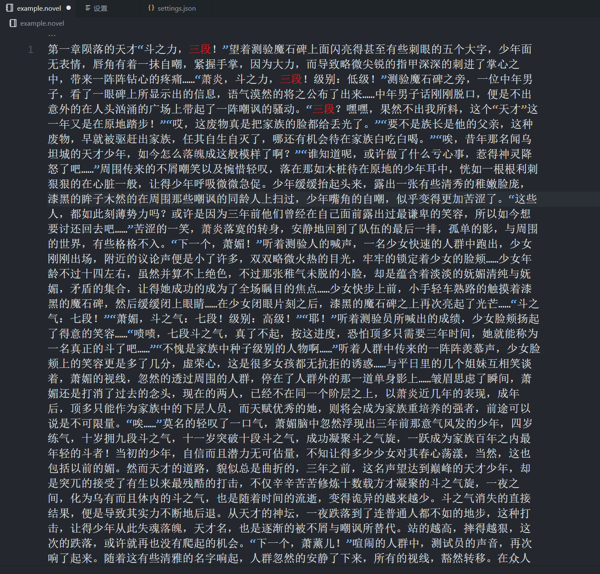
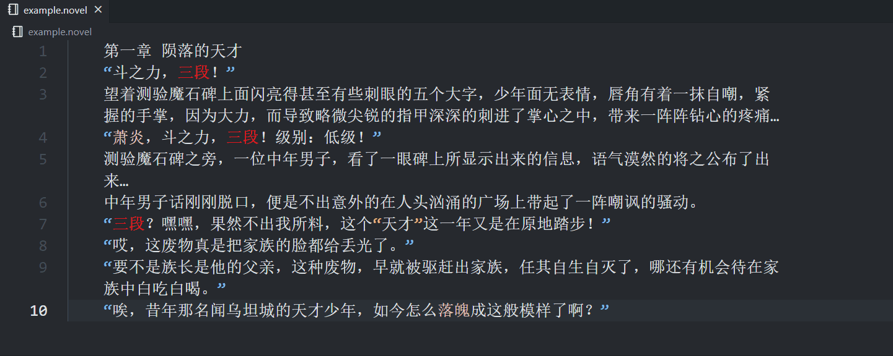
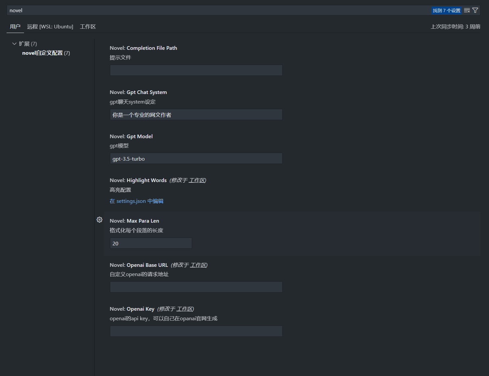

# novel

~~你还在为文笔太烂而烦恼吗，还在为没有灵感而发愁吗？~~

为各位~~扑街~~白金大神提供的**网文写作**VSCode插件，提供高亮、提示、gpt等功能。

## 文件

插件编辑的文件后缀名要为`.novel`或缩写`.nv`

## 基本功能

### 高亮

可自由选择与取消高亮关键词，比如人物名称等

### 提示

根据输入词提示，可自己配置提示词。

注意：在没有触发提示的时候可以手动用`ctrl`+`space`触发提示，快捷键设置可以在键盘快捷键里搜索`触发建议`。

### 格式化

**注意**：文本的格式化并不能像代码一样有统一的规范，而且每个人的写作风格都完全不同，这里仅是个人实现，请斟酌使用

默认每段长度为20，可以自己配置合适的长度，~~亲测长度越短一句一段效果最好~~

### 维基百科

选择并悬浮需要查询的词汇，该功能需要一个可以**访问维基百科**的网络环境

### gpt提问

使用条件: 
1. 该功能需要你有自己的gpt账号，并且创建了自己的apikey，在👉[官网](https://platform.openai.com/account/api-keys)创建
2. 你需要一个可以**访问gpt**的网络环境(重要！)

#### 自定义配置

在设置修改配置，或者在工作区.vscode目录下的settings.json配置文件中自定义配置

## 其他

有问题，改进意见可以在[issue](https://github.com/eirueirufu/novel/issues)里提哦。

如果该插件对你有帮助，请给我个star⭐吧~